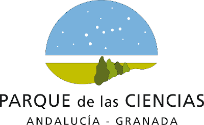

# Impresión solidaria

Se trata de una iniciativa social que nace en el [Club Robótica Granada](https://clubroboticagranada.github.io/) con el objetivo de hacer llegar un regalo a los hijos de aquellas familias que están pasando por una mala situación.

Cada impresor meterá en una bolsa con cierre hermético tipo zip (de las típicas usadas en congelación de alimentos) de 15 x 20 cm, las piezas impresas en 3D, el manual de instrucciones de cada modelos, impreso en color si es posible, y el protocolo seguido para el embolsado de cada modelo.

El protocolo que se ha tenido en cuenta lo podemos descargar del siguiente enlace:

[Protocolo frente a la covid-19 de obligado cumplimiento para los impresores](../protocolo/protocolo.pdf)

En la entrada modelos del índice tenemos enlaces donde encontraremos los archivos stl listos para imprimir y el manual de instrucciones en un archivo comprimido que contiene todos los elementos necesarios para completar la bolsa.

**Gracias por tu solidaridad**

***

Colabora con esta iniciativa el

[Parque de las Ciencias de Andalucía - Granada](https://www.parqueciencias.com/parqueciencias/)

